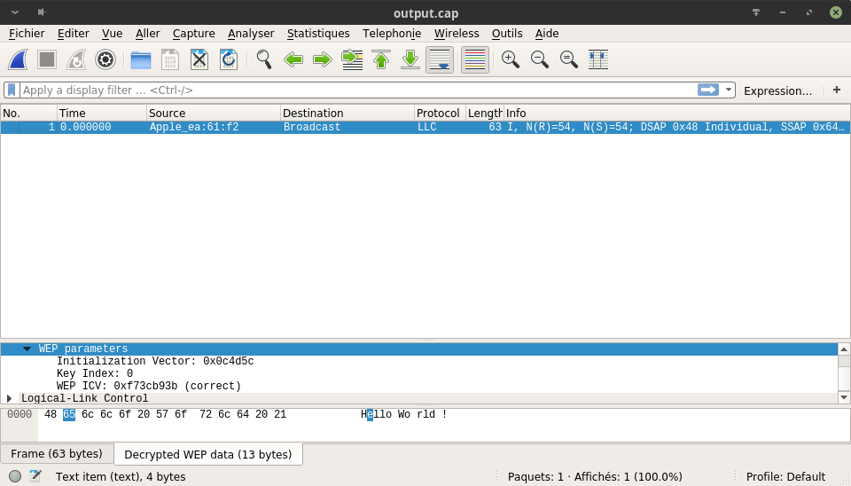

# Sécurité des réseaux sans fil
>by Loic Frueh and Dejvid Muaremi
## Laboratoire 802.11 Sécurité WEP

### 1. Déchiffrement manuel de WEP   
- Comparer la sortie du script avec la capture text déchiffrée par Wireshark
  **Résultat du terminal**
  
  **Résultat de wireshark**
  

On voit bien que les textes sont déchiffré de la même manière cependant wireshark garde l'ICV chiffré, toutefois on voit l'indication **correct** par wireshark qui nous indique qu'il est valide.

### 2. Chiffrement manuel de WEP

### 3. Fragmentation
**Premier fragment**

**Fragment intérmediaire**

**Dernier fragment**

